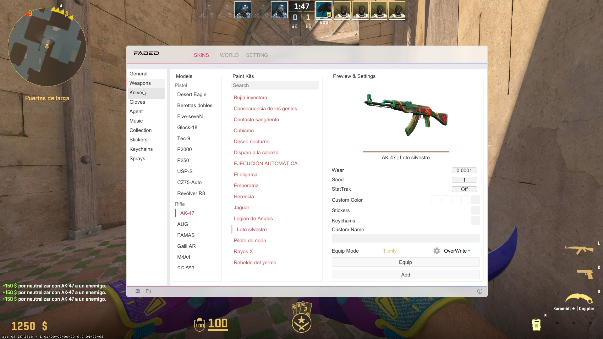

# Faded Skin Changer - Free CS2 Skin Changer

Free **CS2 Skin Changer** for Counter-Strike 2 with support for weapon skins, knives, gloves, agents, stickers, charms, pins, music kits and more.

Customize your Counter-Strike 2 loadout and quickly preview different cosmetic combinations directly in-game.

## Features

- Weapon skins
- Knives
- Gloves
- Agents
- Stickers
- Charms
- Pins
- Music Kits
- Custom cosmetic combinations
- Simple in-game HUD
- Easy installation
- Windows support

## Windows Defender Notice

Because Faded Skin Changer interacts with Counter-Strike 2 at a low level, Windows Defender or other antivirus software may detect the launcher as suspicious or potentially unwanted.

This type of detection can occur with game injectors and memory-modifying tools because of how they interact with running processes.

If Windows Defender blocks the launcher, review the detection information before allowing it.

For additional safety:

- Download Faded Skin Changer only from this official GitHub repository.
- Avoid modified versions or third-party mirrors.

## Installation

1. Click the green **Code** button at the top of the repository.

2. Click **Download ZIP**.

3. Extract the downloaded folder to a location of your choice.

4. If Windows Defender blocks the launcher, review the detection and, if you trust the file you downloaded from this repository, allow the launcher or add the extracted launcher folder as an exclusion.

5. Open **Counter-Strike 2**.

6. Run:

`FadedLauncher.exe`

After a few seconds, the Faded Skin Changer HUD should appear on your screen.

By default, the HUD can be hidden or shown using the **Insert** key. The hotkey can also be changed from the settings.

## How to Use

1. Launch Counter-Strike 2.
2. Run `FadedLauncher.exe`.
3. Open the Faded Skin Changer HUD.
4. Select the cosmetic category you want to customize.
5. Choose your skin, knife, glove, agent, sticker, charm, pin or music kit.
6. Apply your selection.

## Supported Cosmetics

### Weapon Skins

Browse and select weapon finishes for rifles, pistols, SMGs, shotguns, sniper rifles and other CS2 weapons.

### Knives

Select different Counter-Strike 2 knife models and finishes.

### Gloves

Combine gloves with knives and weapon skins to create custom loadouts.

### Agents

Choose between supported Counter-Strike 2 agent models.

### Stickers

Customize supported weapon skins with different stickers.

### Charms

Support for Counter-Strike 2 weapon charms.

### Pins

Select supported CS2 collectible pins.

### Music Kits

Choose between available Counter-Strike 2 music kits.

## Screenshots

Screenshots and previews of the Faded Skin Changer interface can be added here.

Example:

## FAQ

### What is Faded Skin Changer?

Faded Skin Changer is a cosmetic customization tool designed for Counter-Strike 2.

### What cosmetics are supported?

The tool supports weapon skins, knives, gloves, agents, stickers, charms, pins, music kits and other supported CS2 cosmetic items.

### Does it support knives and gloves?

Yes. Knives and gloves can be selected and combined with other cosmetic items.

### Does it support CS2 charms?

Yes. Supported Counter-Strike 2 charms can be selected from the interface.

### How do I open the Skin Changer menu?

By default, the HUD can be shown or hidden using the **Insert** key.

## Updates

Faded Skin Changer may be updated as Counter-Strike 2 receives new cosmetics, items and game updates.

Check this GitHub repository for the latest version.

## Disclaimer

This project is not affiliated with, endorsed by, or sponsored by Valve Corporation.

Counter-Strike, Counter-Strike 2, Steam and their respective names, logos and trademarks are property of Valve Corporation.

Use third-party software at your own discretion.
